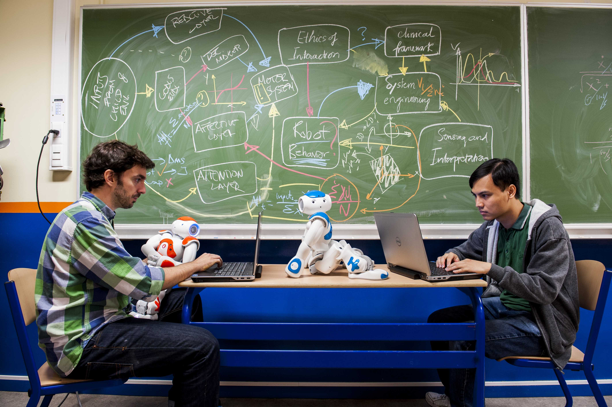

# About the DREAM Project

## Introduction to ASD

Autism is a neurodevelopmental disorder characterized by impaired social interaction, verbal and non-verbal communication, and by restricted and repetitive behaviour. The diagnostic criteria require that symptoms become apparent before a child is three years old.

Autism has a strong genetic basis; however the genetics of autism are complex and it remains unclear whether ASD is explained more by rare mutations, or by rare combinations of common genetic variants. In rare cases, autism is strongly associated with agents that cause birth defects. The prevalence of autism is 1 in every 110 children and the Centre for Disease Control and Prevention reported, in 2012, that one in 88 American children (one in 54 boys) are on the autism spectrum with a prevalence rate increasing at 17% per year (an increase of which only 50% can be explained by a better diagnosis). This demonstrates the prevalence of ASD and its significance as an urgent public health concern.

Parents usually notice signs in the first two years of their child’s life. The signs usually develop gradually, but some autistic children first develop normally and then regress. Several studies have shown the benefits of early diagnosis and intervention for children with developmental disabilities and, particularly, for those with difficulties on the autism spectrum.

## What is RAT/RET?

In clinical interventions, skill transfer from therapist to children with autism spectrum disorders (ASD) benefits from the inclusion of expressive artefacts such as puppets and animated characters. Well-designed robotic agents have proven to be particularly effective and are becoming an increasingly important tool for mediating between therapists and ASD children in robot-assisted therapy (RAT). However, therapeutic interventions require significant human resources over extended periods. Consequently, to make a significant difference, therapeutic robots need to have a greater degree of autonomy than current remote-controlled systems. Furthermore, they have to act on more than just the child’s directly-observable movements because emotions and intentions are even more important for selecting effective therapeutic responses. The next generation of RAT, which we refer to as robot-enhanced therapy (RET), is able to infer the ASD children’s psychological disposition and assess their behaviour in order to select therapeutic actions. Since children require therapy tailored to individual needs RET robots can provide this too. Driven by therapists, DREAM has delivered next-generation RET, developing clinical interactive capacities for supervised autonomy therapeutic robots; robots that can operate autonomously for limited periods under the supervision of a therapist. The DREAM robot also function as a diagnostic tool by collecting clinical data during therapy. It operates under strict ethical rules and the DREAM project provides policy guidelines to govern ethically-compliant deployment of supervised autonomy RET.

## Our Robots

NAO is the most widely used robot in education and research, being the official robot of the RoboCup tournament. It is used in computer and science classes, from primary school through to university, in more than 70 countries. It has also make its impact on the communities of developers, who recognise it as a powerful and expressive medium for creating applications.

The ASK NAO (Autism Solution for Kids) initiative is a program created by Aldebaran Robotics to customize NAO to support teachers with in-class tasks and help children with ASD.

Probo is an imaginary animal type with an own identity, including a name, a history, and friends and family.

The name Probo is derived from the word proboscidea. Proboscidea is an animal order now containing only one family of living animals, “the elephants”, with three species (African Bush Elephant, African Forest Elephant, and Asian Elephant). During the period of the last ice age there were more, now extinct species, including a number of species of the elephant-like mammoths and mastodons.

Probo has a very “huggable” appearance, an attractive trunk, animated ears, eyes, eyebrows, eyelids, mouth, neck, and an interactive belly-screen. The internal mechanics of the robot are placed inside a plastic housing and covered with a foam layer and a removable fur-jacket, in such a way that Probo looks and feels like a stuffed animal. The colour of the robot is green, evoking mainly positive emotions such as relaxation and comfort.

## Smart Environment

The smart environment augments the sensory capabilities of the robot, providing it with information that would otherwise have required very advanced perceptual and cognitive capabilities. Such purpose is achieved through off-body sensors, since children with ASD do not like having to wear sensors, especially cumbersome ones that may agitate their sensitive skin. In order to ease the complexity of the sensing and data-fusion task, the traditional therapy room has been transformed into a smart space environment with a set of additional sensors that provide information. 

A novel multi-camera system capable of capturing child movements and interactions with the robot and therapist has been designed. This system consists on several Microsoft Kinect® cameras and high resolution cameras distributed over the room to cover expected (physical) locations of the child’s motions and facial expressions; some cameras are positioned around the table between the child and the social robot to capture the interaction; and the cameras in the robot itself. 

## About Us

DREAM was a project funded by the European Commission and developed by seven different partners:

<ul>
 	<li style="list-style-type: none;">
<ul>
 	<li style="text-align: justify;"><a href="http://www.his.se/" target="_blank" rel="noopener"><strong>University of Sk</strong><strong>ö</strong><strong>vde (HIS):</strong></a> HIS was the coordinating partner and contributed expertise in cognitive architectures, embodied cognition and social interaction. The HIS team was responsible for work packages dealing with systems integration as well as the assessment of children's behaviours and mental states.</li>
</ul>
</li>
</ul>
<ul>
 	<li style="list-style-type: none;">
<ul>
 	<li style="text-align: justify;"><a href="http://www.vub.ac.be/" target="_blank" rel="noopener"><strong>Vrije Universiteit Brussel (VUB):</strong></a> This is a Belgian university located in Brussels. VUB has designed and built the robot Probo. VUB further has experience with cognitive architectures and experiments with ASD children. They are responsible of developing some of the modules of the cognitive architecture.</li>
</ul>
</li>
</ul>
<ul>
 	<li style="list-style-type: none;">
<ul>
 	<li style="text-align: justify;"><a href="http://www.ubbcluj.ro/ro/" target="_blank" rel="noopener"><strong>Universitatea Babeş-Bolyai</strong><strong> </strong><strong>(UBB):</strong></a> UBB is one of the most prestigious and oldest educational and scientific establishments in Romania. Researchers and psychologists from this university have expertise in running clinical trials and provided information about the psychological therapies to be implemented within the robots, and about the intervention and diagnosis protocols.</li>
</ul>
</li>
</ul>
<ul>
 	<li style="list-style-type: none;">
<ul>
 	<li style="text-align: justify;"><a href="http://www5.plymouth.ac.uk/" target="_blank" rel="noopener"><strong>Plymouth University (PLYM): </strong></a>PLYM collaborated with VUB to develop the cognitive architecture of the robots. PLYM has experience in developing biologically inspired action selection mechanisms using memory as the central mechanism for governing autonomous behaviour.</li>
</ul>
</li>
</ul>
<ul>
 	<li style="list-style-type: none;">
<ul>
 	<li style="text-align: justify;"><a href="http://www.port.ac.uk/" target="_blank" rel="noopener"><strong>University of Portsmouth (PORT):</strong></a> The smart environment was designed and implemented by this British university. They have substantial experience in multi-sensory data fusion, especially sensing and analytics for multi-camera systems.</li>
</ul>
</li>
</ul>
<ul>
 	<li style="list-style-type: none;">
<ul>
 	<li style="text-align: justify;"><a href="http://dmu.ac.uk/home.aspx" target="_blank" rel="noopener"><strong>De Montfort University (DMU): </strong></a>In a project that brings together children and robots in a therapeutic context, it is crucial to heed all ethical issues this raises. DMU in Leicester, UK is responsible for these matters.</li>
</ul>
</li>
</ul>
<ul>
 	<li style="list-style-type: none;">
<ul>
 	<li style="text-align: justify;"><a href="http://www.aldebaran.com/en" target="_blank" rel="noopener"><strong>Aldebaran Robotics (ALD):</strong></a> This French company conceives, develops, manufactures, and commercialises humanoid robots, as NAO, and their corresponding control software. They also have some experience in experiments with ASD children.</li>
</ul>
</li>
</ul>
